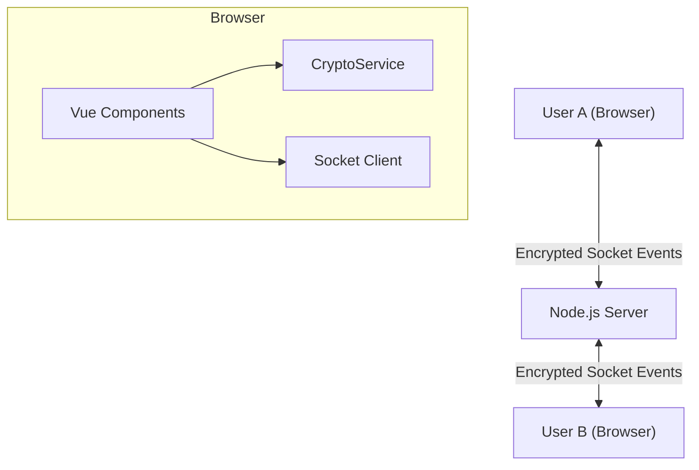

# P2PChat Architecture Documentation

## Overview
P2PChat is an anonymous, peer-to-peer (mock P2P via relay), end-to-end encrypted chat application. It allows users to connect with strangers via a lobby and chat securely without creating accounts or storing data on a server.

## Technology Stack
- **Frontend**: Vue.js 3 (Vite)
- **Backend**: Node.js + Express
- **Real-time Communication**: Socket.io
- **Cryptography**: Web Crypto API (Native Browser API)

## Architecture Diagram

## Global Data Flow
1. **Key Generation**: Upon loading the login screen, the browser generates two pairs of RSA-2048 keys (one for encryption, one for signing) using `CryptoService.js`.
2. **Key Exchange**: When joining, public keys are sent to the server and stored in memory associated with the socket ID.
3. **Lobby**: The server broadcasts the list of connected users (username, public keys, status) to all clients.
4. **Chat Initiation**:
   - User A requests connection to User B.
   - User B accepts.
   - Server puts both in 'busy' state and exchanges their public keys.
5. **Messaging**:
   - User A types a message.
   - `CryptoService` signs the message (User A's Pvt Key) and encrypts it (User B's Pub Key).
   - Encrypted package is sent to Server.
   - Server blindly relays to User B.
   - User B decrypts and verifies the signature.

## Directory Structure
- `server/`: Backend code.
  - `index.js`: Main server entry point, handles socket events and in-memory user store.
- `src/`: Frontend code.
  - `components/`: Vue components.
    - `LoginView.vue`: Landing page, key generation, login.
    - `LobbyView.vue`: User list, search, connection management.
    - `ChatView.vue`: Active chat interface.
  - `status/`: Data services.
    - `CryptoService.js`: Wraps Web Crypto API for all security ops.
  - `util/`: Helper functions.
  - `socket.js`: Socket.io client instance.
  - `App.vue`: Main layout and state manager (routes views based on state).

## Key Design Principles
- **Ephemeral**: No database. All state is in RAM. Server restart wipes everything. Browser refresh wipes user identity.
- **Privacy First**: Server cannot read messages.
- **Simplicity**: Single-page application logic managed via simple state variables (`view` ref) instead of complex routing.
